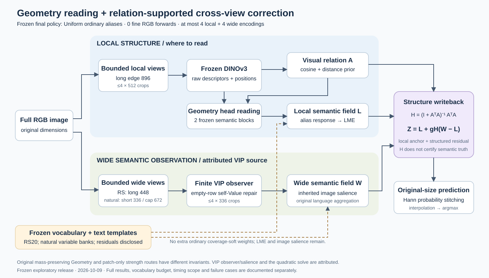
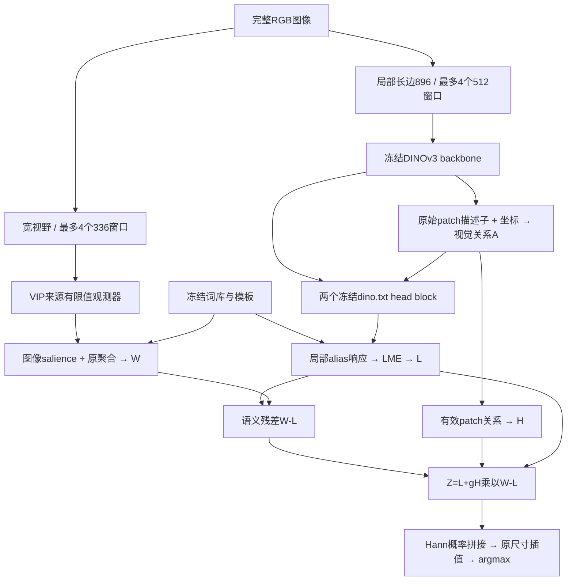

# 当前冻结模型架构

终版不是“20词＋RivalFineHard＋原生分辨率细视野”的旧高成本模型。当前实现签名为 `geometry-task-alias-global-finalization-v1-20261009`，普通alias策略为全局 `uniform`。旧方法保留作研究记录。

## 1. 视觉结构负责在哪里读

从冻结backbone描述子和归一化patch坐标构造行归一化关系：

\[
A_{ij}=\operatorname{softmax}_j\left(\frac{\langle\hat f_i,\hat f_j\rangle}{0.10}-\frac{\|x_i-x_j\|^2}{2(0.25)^2}\right).
\]

这个关系复用于两个冻结dino.txt语义head block，而非每层从被干预后的语义状态重新估计。Value、输出投影、LayerScale、residual、MLP及最终投影仍来自预训练模型。

必须区分两条历史路线：原Geometry保留native特殊token贡献和patch总质量，只替换条件patch关系；patch-only路线让patch query读取缩放后的 `s A V_patch`，阻断其prefix Value路径，prefix query仍保留原路径。当前任务配置会使用既定强度菜单；不能把原Geometry的质量守恒性质直接移给strength1/2/3。

源码：[Geometry执行](../DINOtool/dinotool/geometry_execution.py)、[Geometry语义通路](../DINOtool/dinotool/geometry_readout_trace.py)、[任务读出](../DINOtool/dinotool/taxonomy_readout.py)。

## 2. 语言接口负责提供什么证据

局部按冻结词库的alias响应做log-mean-exp：

\[
L_{pc}=\frac{T}{t_l}\left[\log\sum_{a\in\mathcal A_c}\exp(s_{pca}/T)-\log K_c\right],\quad T=0.07.
\]

其中 `t_l`来自既定profile。Uniform取消的是额外coverage-soft重分配，不取消LME的响应依赖性。宽视野继续使用VIP来源的图像条件salience与原聚合；高响应不等于语义正确，canonical也不是真值。

遥感保留冻结20词库与既定图像canonical-margin选路；自然使用已开发的变长词库、模板及文本有效秩profile菜单。VOC/COCO残余概念与PC60额外401概念的protected处理单列，不当成前景同义词筛选。

源码：[终版mask-free API](../DINOtool/dinotool/taxonomy_inference.py)、[局部聚合](../DINOtool/dinotool/packed_alias_readout.py)、[有限VIP观测器](../DINOtool/dinotool/finite_vip_observer.py)。

## 3. 结构耦合负责修正写到哪里

对有效patch关系进行mask及重归一化后构造：

\[
H=(I+A^\top A)^{-1}A^\top A,\qquad Z=L+gH(W-L).
\]

在 `g=1` 时，这是经典二次目标 `min_Z ||Z-L||² + ||A(Z-W)||²` 的闭式解。本文研究的对象是视觉关系/读取通路及同观测预算下的耦合用途，不宣称发明该线性代数解。`g=2`允许外推，不再精确求解同一个目标。H可含负元素，不是非负概率传播，也不保证逐位置语义正确。

固定H与g后，任何词干预满足：

\[
\Delta Z=(I-gH)\Delta L+gH\Delta W.
\]

因此非road类的词也能改变road竞争边界；只看本类IoU无法判断某个本类词的独立价值。必须同时分析正确覆盖损失、竞争误激活与最终预测。

源码：[耦合与profile](../DINOtool/dinotool/development_readout.py)、[有效关系算子](../DINOtool/dinotool/alias_action_capacity.py)。

## 4. 整图预算与实际归属

局部长边896，最多4个512窗口；遥感宽视野长边448，自然short336/cap672，最多4个336窗口。无fine RGB编码；多种局部head强度复用backbone tokens，但head计算仍计时。没有按原图大小无限增长的88次Geometry编码。

Geometry的关系存储/求解仍有patch二次复杂度，不能称线性attention。全局Uniform关闭额外普通竞争重分配；保留的PC60残余处理与两个常驻视觉模型使显存并不等同单分支VIP。

真正已测的增量看[同观测端点和融合表](RESULTS.md)。八遥感对简单融合平均+2.1869pp，但对局部仅平均+0.2951pp，部分域负迁移；COCOObject耦合低于宽视野。这个边界比“每次修正都正确”的故事更符合结果。
