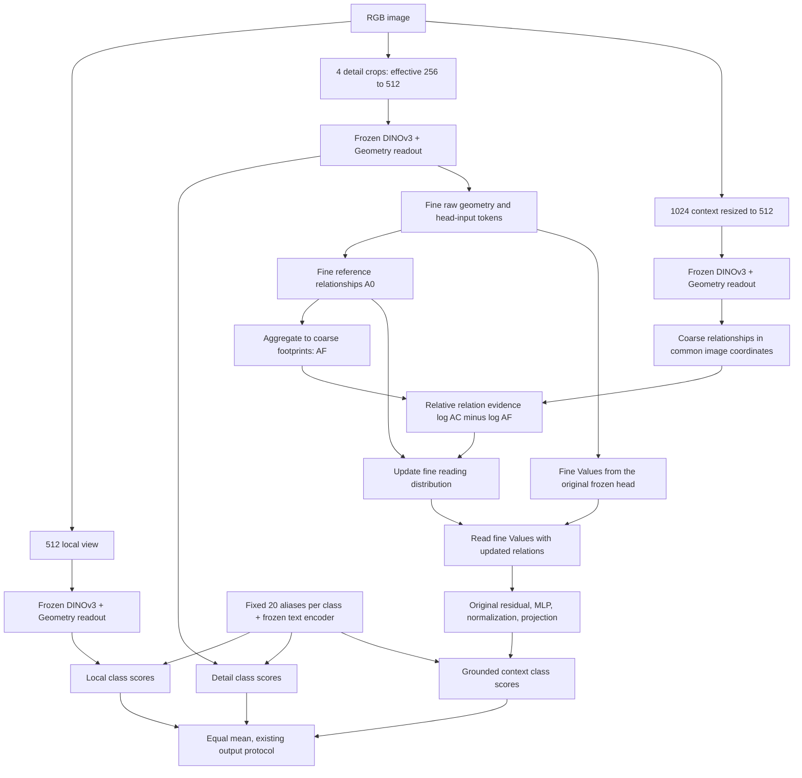

# Cross-scale Geometry Grounding：候选架构与 CVPR 主张

日期：2026-09-29。状态：基于已完成 GEAR-OV v2 八集结果的设计稿；本次没有修改模型、启动 GPU 或声称新版本有效。

## 1. 推荐决策

保留冻结 DINOv3/DINO.text、两层 Geometry、固定每类 20 aliases、类内 normalized log-mean-exp、既有数据与拼接协议。

第二模块建议定义为 **Cross-scale Relation Grounding**：粗尺度提供相对于细尺度的新关系，细尺度提供具有明确空间来源的 Values；在原冻结视觉头内重新读取细粒度证据，最后才做文本分类。

核心可检验主张：**在冻结 OVSS 中，转移粗尺度的关系增量、保留细尺度的视觉内容，可能比直接转移已经混合的粗尺度内容更稳健。**

这比泛称“用几何给 context 定位”更具体。关系替换、特征上采样、KL 倾斜本身都有先例；当前只能称候选贡献，不能凭名称判定 CVPR 级首创。

## 2. 必须先纠正的证据解释

### 2.1 多尺度不是普遍损害 road/building/tree

Multiscale 相对 Geometry 的逐类 IoU 变化：

| 数据集/协议 | 类别 | 变化，百分点 |
|---|---|---:|
| LoveDA P | road / tree / building | +3.1351 / +3.5193 / +1.1796 |
| LoveDA D | building | -0.9384 |
| OEM | road / tree | +0.3016 / +0.9617 |
| VDD | road / roof | +2.5297 / +4.8195 |
| FLAIR-1 | building | -3.2991 |
| LandCover.ai | building | -2.8960 |

农田在 LoveDA/OEM/FLAIR 有多次正增益；但“大区域更受益、小区域更受损”需要按真实面积、宽度、边界分桶，不能仅凭类别名称确定。

### 2.2 当前 Multiscale 同时增加 detail 与 context

现有 `gear_ov.py` 每个 512 工作区含 local 一次、四个 detail crop、1024→512 context 一次，共六次 backbone 编码。Multiscale 是三路 class logits 的等权平均。

因此其增益可能来自细节放大、不同裁剪上下文、粗尺度大视野及其组合。必须有 local+detail 对照，才能分离 coarse context 的净贡献。

### 2.3 GEAR 已经做了一个跨尺度 grounding 初版

`build_support` 以 raw DINO 跨尺度余弦与坐标构造最多 64 条 context→fine 边，保留映射的 4×4 子格；不是全图均匀广播。

其上下文预测及责任为：

\[
\widehat y_{ja}=\tau\log\sum_i K_{ji}\exp(X_{ia}/\tau),\qquad
\frac{\partial\widehat y_{ja}}{\partial X_{ia}}
=\operatorname{softmax}_i(\log K_{ji}+X_{ia}/\tau).
\]

风险有两个：跨尺度 raw token 本身可能是混合表征；LME 责任又更偏向当前高 alias 响应位置。coarse 观测也没有被证明等于 fine logits 的 LME。

LoveDA P 的平均推理目标由 0.0461976 降至 0.0276299，但最终 mIoU 比 Multiscale 低 2.9468。能量下降不能替代分割机制证据。GEAR 还改变了 detail/context 的有效融合强度，故其失败不能全归因于 K。

## 3. 为什么单纯 cross-attention 不够

若粗 token 包含 road/building/tree，普通跨尺度读取为：

\[
\widetilde v_i=\sum_jw_{ij}v_j^{coarse}.
\]

即使 w 精确指向某个粗格，读到的 v 仍可能混有三类内容。同一粗格的两个子像素若只收到同一个 mixed Value，就没有自动获得各自的语义成分。

几何对应仍然有价值，但“对应粗格正确”与“格内语义分解正确”是不同问题。一个标量权重不能保证解开一个混合向量。

候选选择从混合发生之前改变读取：让 coarse 关系指出候选区域，让 fine 对 fine 的关系决定具体成员，聚合实际 fine Values。无需先假设粗 logits 是某个细粒度生成模型的观测。

## 4. 完整框架：两个模块，三路输出

模块一仍是 Geometry 观测/读取。模块二是“相对关系驱动的细证据重读”。映射、关系差分、概率归一和 frozen head 操作是第二模块的内部计算，不拆成多个命名贡献。

最终候选把原 Multiscale 的 coarse-logit 分支替换为重读分支，其余两路和三路等权公式保留。原 Multiscale 作为独立强对照保留，不能声称两者最终计算图完全一样。

## 5. 单一核心算子

### 5.1 同一坐标系与细尺度参考

细节网格为中心 512 工作区内的 64×64 tokens。context 为 1024 视野上的 32×32 tokens，中心 16×16 覆盖该工作区。令 p(i) 为 fine token i 所在 coarse 格，P 为已知坐标映射。这里只用图像裁剪与采样坐标，不用 GT。

用同尺度 raw DINO 特征 h_i 构造细参考：

\[
A^0_{ir}=\operatorname{softmax}_r\left[
\langle\hat h_i,\hat h_r\rangle/\tau_g
-\|x_i-x_r\|^2/(2\sigma^2)\right].
\]

新模块的 fine/coarse 关系均用共同原图坐标、同一物理带宽计算，避免把不同视野内归一化坐标造成的空间核差异当成语义增量。原有三个基线的 Geometry 不改。原型沿用 tau_g=0.1；共同坐标按 enclosing 1024 workspace 定义，带宽从既有 context Geometry 配置换算一次，全部数据集共用。

参考关系先在四个 detail crop 的全部有效成员上定义，按 query 分块精确计算，不因 coarse 的 top-k 选择而改变候选集。N=4096 的矩阵可按 256 个 query 分块，避免长期保存完整多头 N²。第一版不把 top-k 稀疏化作为额外贡献。

### 5.2 细尺度已经知道哪些粗区域关系

把 fine 关系按已知足迹聚合：

\[
A^F_{ab}=\frac1{|I_a|}\sum_{i\in I_a}\sum_{r\in I_b}A^0_{ir},
\qquad I_a=\{i:p(i)=a\}.
\]

A^F 的每行和为 1，描述“细尺度原本已倾向于从哪些粗格读取”。边缘与 padding 只统计有效成员，不用固定16代替有效人数。

### 5.3 粗尺度独有的关系增量

从全景 raw DINO 特征构造 A^C。一个中心粗格可能读中心，也可能读外圈。当前 fine Values 只覆盖中心，故定义：

\[
a_a=\sum_{b\in center}A^C_{ab},\qquad
\bar A^C_{ab}=A^C_{ab}/a_a.
\]

a_a=0 时直接保留 A0。否则比较粗关系与细关系：

\[
R_{ab}=\log(\bar A^C_{ab}+\epsilon)-\log(A^F_{ab}+\epsilon).
\]

R>0：粗视野认为这条联系比细视野看到的更重要；R<0：相对降低。两者一致则没有额外关系修正。epsilon 仅用于数值稳定，候选初值1e-6，不能称为可靠性概率或逐集调优阈值。

### 5.4 按细几何分配关系增量

\[
\widehat A_{ir}
=\frac{A^0_{ir}\exp R_{p(i),p(r)}}{\sum_uA^0_{iu}\exp R_{p(i),p(u)}}.
\]

它是下列 KL 目标的闭式解：

\[
\widehat A_i=\arg\min_{b\in\Delta}
\left[\mathrm{KL}(b\|A^0_i)-\sum_rb_rR_{p(i),p(r)}\right].
\]

此优化原理不是新发明。可研究的差异是 R 的来源，以及读取对象是有空间来源的 fine Values。

外圈没有 fine Values，不把它们的质量强行塞给中心或 coarse 自环。使用：

\[
A^*_{ir}=(1-a_{p(i)})A^0_{ir}+a_{p(i)}\widehat A_{ir}.
\]

这里 a 是已有关系中落在可用 donor 范围内的质量，不是另一个置信 gate。它只处理观测覆盖缺口，不能据此声称识别错误上下文。

所有 log、归一化和关系比在 FP32 计算。A^F 很小时的比值可能放大偶然关系；第一版必须输出 R 分位数、最大边权、KL(A*||A0) 和有效边数。数值正常并不保证语义正确。

### 5.5 细 Values 重读，而后使用原文本头

对原冻结头第 b 个被修改的块：

\[
V^{(b)}_r=W_V^{(b)}\mathrm{LN}(u_r^{(b)}),\qquad
m_i^{(b)}=\sum_r A^*_{ir}V^{(b)}_r.
\]

继续使用该块原有 attention projection、residual、LayerScale、MLP、最终归一化与文本对齐 projection。prefix 使用查询原属 detail crop 的 prefix 状态和原 attention mass；不拼一个虚构的全局 CLS，不把 prefix 策略变化混入本模块。

两层都在对应的实际 Geometry 状态上重算 QKV/Values。当前 `TCPRPreparedImage.value_tokens` 来自共享/native 中间路径，不能直接假设它就是两层 Geometry 的逐层 Value 缓存。实现时应保存 backbone token/prefix 输入，并明确每块的读取状态。

最终得到 z_i^R，仍为：

\[
S^R_{ic}=\tau_a\log\left[\frac1{20}\sum_{a\in\mathcal A_c}
\exp(\langle\hat z_i^R,t_a\rangle/\tau_a)\right].
\]

三个分支转成相同的原 score 单位后：

\[
S^{final}=(S^{local}+S^{detail}+S^R)/3.
\]

输出仍使用既有 bilinear、概率化与 Hann 滑窗拼接。没有逐类图像 forward、每类 mask decoder、词表筛选或 GT 校准。

## 6. 可以证明什么，不能证明什么

- 若 coarse 条件关系等于 AF，则 R=0、A*=A0；重复的关系不会再强化一次。
- 若中心可用 coarse 质量为0，A*=A0。
- 每行关系非负且和为1；若所有 fine Values 相同，重读不会在 attention 值混合处凭空制造差别。
- 同一粗格的 road/roof 子像素可因不同 fine 几何分布而读取不同成员；它们不再被强制接收同一个粗 Value。
- 以上是算子性质，不是 mIoU、正确定位或有益修正保证。稠密 softmax 不产生严格隔离，不能写“只影响正确匹配像素”。
- 若 roof/road 的 fine 表征也无法区分，或 coarse 关系把小目标吞没，仍会失败。
- 若正确类别只存在于 coarse Value，而 fine Values 无可用信息，关系转移可能损失原多尺度的农田/场景语义增益。
- 粗 relations 来自经过全景 backbone 的 tokens，仍携带部分外圈信息；但不等价于保留外圈的全部语义 Values。
- 本模块零关系增量时退化为 fine-global reread，并不退回原 Multiscale。最终候选去掉了原 coarse-value 分支；必须用同结构的 A0 重读对照识别这一变化的影响。
- attention 前的值混合是凸组合，不能把它宣传为必然生成 fine 值支持范围之外的语义；后续冻结非线性头同样不保证恢复缺失概念。

## 7. 为什么不是直接乘两张相似度图

直接 A*∝fine_geometry×lift(coarse_geometry) 会把两个尺度共同已有的强联系重复增强。即使 coarse 没有新关系，它也可能改变细读出。

用 coarse/reference 的相对关系提供一个可检验的身份性质；并使第二模块依赖第一模块生成的参考 AF。Geometry 既提供细成员、基础读出与定位，也定义“什么关系是新增的”。这就是两个模块的耦合，不需要再加第三个 alias selector。

但相对关系不是自动去偏，也不等于因果效应。它可能放大跨crop差异和尺度编码误差。必须与直接乘积、同尺度全局重读及坐标打乱对照比较。

## 8. 与最接近方法的边界

本次 Parallel 检索因认证不可用；改为直接核查下列原文/官方仓库。范围有限，不构成完整查新。

| 工作 | 核查到的相关机制 | 本候选必须建立的区别 |
|---|---|---|
| SAPA, NeurIPS 2022 | 将高分辨率 encoder point 与局部 decoder features 比较，确定上采样点的语义归属 | 不能称“coarse-to-fine归属问题从未有人提出”；候选研究冻结 OVSS 内部的跨尺度关系增量与 fine Value 保留 |
| FeatUp, ICLR 2024 | guided JBU 与逐图 implicit 两版本；多视图一致性学习高分辨率特征 | 本候选不拟合一个重建粗特征的上采样网络，也不以重建误差下降替代语义收益 |
| AnyUp, ICLR 2026 | ImageNet上预训练；像素queries、图像/低分辨率特征keys、未处理低分辨率features作values；无需为新encoder重训 | 本候选无额外上采样器训练，读取 fine Values，context 只改变关系。AnyUp本身不能被称为从未训练过 |
| ProxyCLIP, ECCV 2024 | VFM空间对应提供proxy attention，改善冻结CLIP局部一致性 | “关系来自别处、values保留语义”已有先例；需证明尺度相对关系与 mixed-coarse 问题的具体贡献 |
| 当前 GEAR-OV v2 | 几何支持+alias LME观测反演+有符号分数回写 | 本候选在head读取时调整关系，不再反演粗alias logits，不用当前类别置信度决定谁获得残差 |

来源：

- SAPA：https://arxiv.org/abs/2209.12866 ；https://github.com/poppinace/sapa
- FeatUp：https://arxiv.org/html/2403.10516v2
- AnyUp：https://arxiv.org/html/2510.12764v1 ；https://github.com/wimmerth/anyup
- ProxyCLIP：https://github.com/mc-lan/ProxyCLIP ；https://arxiv.org/abs/2408.04883

## 9. 实验顺序与关口

### A. 先分清新增观测的作用

用同一组 L/D/C 编码，报告 L、(L+D)/2、(L+C)/2、(L+D+C)/3。图像集合、20词、输出温度和协议不变。此步确定收益是否确实需要粗 context，不做新词表搜索。

### B. 核心读取机制对照

| 对照 | 改变什么 | 要排除的解释 |
|---|---|---|
| 原 Multiscale | 现有三路等权 | 总体性能与主要参照 |
| Fine-global reread | A0读取同一组fine Values；三路为L/D/F0 | 仅拼接四crop、重复detail、丢掉coarse-values的收益 |
| Direct relation product | 直接相乘coarse/fine核 | 只是普通条件attention能否解释收益 |
| Relative grounding | 本稿相对关系算子 | 是否有超过前述控制的增益 |
| Shuffled-context | 打乱coarse内容对应，保持坐标核和其他预算 | 真实context关系是否有用，还是任意扰动都有效 |

这组共用六次 backbone 观测。head 的额外重读单独计时；不能宣称与单尺度或原 Multiscale 完全同耗时。不能先将外圈fine覆盖扩为16个detail crop，再把新增计算优势归给算子。

### C. 直接检验“分配”而非只看 mIoU

GT 仅进入离线统计：

1. 相对local+detail，原Multiscale纠正的像素中保留多少；原Multiscale毁坏的像素中修复多少。
2. 新候选额外制造的错误，不能只报修复旧错误。
3. 按 coarse 足迹的GT类别混合程度、边界带/内部、物体宽度和连通域面积分桶。混合格内有多个正确类别，不能用majority类宣称minority证据错误。
4. road连通/细结构与building边界；car/vehicle同时报precision、recall和预测面积。现有数据含严重误扩张，不能把所有小目标失败写成漏检。
5. 记录读取的空间来源、跨类别泄漏、最大权重、KL和四个detail拼接边界的退化。attention同类比例只作诊断，并非所有有用上下文都必须同类。

### D. CVPR 实证目标

一个合理的项目目标是：同预算Multiscale之上八集等权均值增加约1个百分点，多个独立域方向一致；不是要求每类每集必涨，更不是CVPR录用阈值。

如果只胜Geometry、不胜Multiscale或Fine-global reread，就没有证实跨尺度新关系的贡献。若只在减少coarse内容后提升，而打乱关系也相同，论文应承认主要收益来自抑制context，而非grounding。

当前八集都已进入设计过程，应如实标为探索性开发。冻结最终方案后保留新的地域/场景或外部集合用于一次验证；不能把已经反复看过的八集重新称作untouched。

Vaihingen当前所有方法约4–5 mIoU，需独立核查输入波段/数据协议后再解释；不能用此结果支持或否定新机制。修复后须所有对照同协议重跑，不能只更新本模型。

## 10. 实现接口与论文叙事

可实现接口：`build_fine_reference`、`aggregate_relations_to_footprints`、`relative_context_relations`、`reread_fine_values`、`cross_scale_grounded_logits`。它们属于一个模块内部函数，不是五个创新。

需要新增的缓存是raw tokens、图像坐标、有效掩码、逐crop prefix与冻结head输入。固定词表一次编码缓存。第一版不缓存跨测试图状态，不更新网络，不做逐图迭代优化。

可称 **fully frozen, feed-forward, training-free inference**，新增可训练参数0；但head额外读取和关系矩阵有实际开销。每个工作区共享六次backbone forward，并非全图只前向一次。

候选论文中心句：

> We investigate whether coarse contextual relations, rather than already mixed coarse contents, provide a more reliable interface for fine-grained evidence reading in frozen open-vocabulary segmentation.

机制获支持后，贡献可分三项而仍围绕同一核心：

1. 定量定位冻结OVSS的跨尺度语义混合和误分配现象，区分新增细节、新增上下文与融合强度。
2. 一个相对关系驱动的细证据重读算子：粗尺度修正关系，细尺度保留Values，原冻结头完成语义读取。
3. 同观测预算、统一规则的跨域结果与对应机制证据。

标题可围绕“Transfer Relations, Preserve Fine Evidence”，但不能用标题代替与ProxyCLIP/SAPA/AnyUp的实质比较。现阶段最合理的决策是实现该单核候选并过机制关口，而不是继续追加GAR、词表gate或重建loss。
