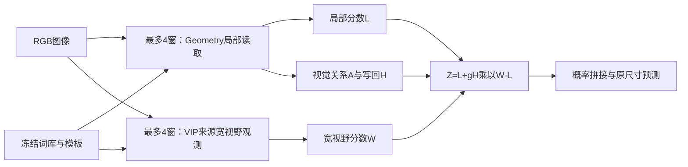

# 最终 Geometry 耦合模型：冻结结果与论文边界

统一 ordinary alias policy：`uniform`；全部15协议、45200次协议图像评测及修正后的独立成本完成。VOC20/21、PC59/60共享来源，不能称为同数量独立图像。

终版入口为 `TaxonomyInference.for_finalization`，必须显式传入本清单词库和任务信息；历史默认入口不变。这个结论冻结一个整体配置，不拼接历史单域最佳分数。

结构是 Geometry 局部读取＋明确归属的 VIP 宽视野观测＋Geometry 支持的修正写回。额外词权重不是核心创新；局部 LME 和宽视野 salience 已使词贡献依赖响应，但没有证明它们能判断语义正确性。

局部长边896；遥感宽视野长边448，自然宽视野短边336/长边上限672。无fine编码、无按原图尺寸无限增长的滑窗数量。

词库不是所有协议固定20：遥感保留冻结的20词库与既定选库规则，自然使用已开发的变长词库（普通前景通常1–18词，VOC20为3–18词），VOC21/COCOObject残余类另含更多表达，PC60还使用额外401残余概念。逐类词数见final_model.json的vocabulary_budget，词表/模板/选路仍由冻结protocol.json给定。变长支持是输入能力，不是已验证的词表稳健性创新。

## 完整结果

| 协议 | 图像 | Retained | Uniform | 最终版 | 同观测局部 | 同观测等权融合 | VIP声明/蒸馏配置 | VIP原20参考 | 最终−声明VIP pp |
| --- | ---: | ---: | ---: | ---: | ---: | ---: | ---: | ---: | ---: |
| vdd/vdd | 80 | 55.2382 | 55.1305 | 55.1305 | 52.9857 | 53.1170 | 52.0647 | 51.4827 | +3.0658 |
| potsdam/potsdam | 504 | 49.7888 | 49.7278 | 49.7278 | 50.2473 | 46.9773 | 44.8995 | 42.3028 | +4.8283 |
| voc20/voc20 | 1449 | 92.1747 | 92.1747 | 92.1747 | 82.2765 | 92.0500 | 92.5051 | 未测同池全量 | -0.3304 |
| voc21/voc21 | 1449 | 70.4508 | 70.4508 | 70.4508 | 27.3117 | 63.3533 | 73.2591 | 未测同池全量 | -2.8083 |
| ade150/ade150 | 2000 | 31.1862 | 31.1862 | 31.1862 | 27.4223 | 29.7892 | 29.1387 | 未测同池全量 | +2.0475 |
| context60/context60 | 5105 | 41.6004 | 41.6004 | 41.6004 | 36.1110 | 40.9204 | 42.5987 | 未测同池全量 | -0.9983 |
| udd5/udd5 | 40 | 48.3659 | 48.3506 | 48.3506 | 48.9404 | 46.7980 | 44.9713 | 41.4336 | +3.3793 |
| oem/oem | 384 | 39.7079 | 39.5582 | 39.5582 | 43.1075 | 35.7775 | 35.0388 | 33.2064 | +4.5194 |
| vaihingen/vaihingen | 113 | 52.3345 | 52.3535 | 52.3535 | 51.4182 | 50.0354 | 41.9062 | 47.3620 | +10.4473 |
| landcoverai/landcoverai | 1602 | 65.5713 | 65.5954 | 65.5954 | 61.9719 | 63.8458 | 50.2980 | 54.9420 | +15.2974 |
| loveda/P | 1669 | 64.4663 | 64.4340 | 64.4340 | 67.5769 | 61.0071 | 55.0261 | 56.3110 | +9.4079 |
| loveda/D | 1669 | 40.2673 | 40.3047 | 40.3047 | 41.4210 | 38.5148 | 35.3436 | 36.1457 | +4.9611 |
| context59/context59 | 5105 | 45.1338 | 45.1338 | 45.1338 | 37.9339 | 44.4838 | 未完成全量比较 | 未测同池全量 | 未完成全量比较 |
| coco_object81/coco_object81 | 5000 | 44.2396 | 44.2396 | 44.2396 | 23.5264 | 43.2747 | 48.9955 | 未测同池全量 | -4.7559 |
| coco_stuff171/coco_stuff171 | 5000 | 32.8235 | 32.8235 | 32.8235 | 28.5385 | 32.6686 | 33.4867 | 未测同池全量 | -0.6632 |
| flair1/flair1 | 15700 | 42.5056 | 42.4460 | 42.4460 | 41.0144 | 40.9058 | 36.6074 | 35.2977 | +5.8386 |

八遥感均值（LoveDA D一次）：{"Uniform": 49.18333749999999, "UniformLocal": 48.8883, "UniformMean": 46.99645}。

VIP列均为本地有限行数值修复后的测量，不是论文认证复现。遥感三域为官方短词，其余五域为蒸馏外部词库；VIP20是原20适配。Vaihingen采用修正输入。自然缺失的完整比较保留为空；不得引用pilot填补。整体比较的词库/信息预算不同，不能单独归因Geometry。

## 冻结判据与配对机制证据

{"status": "frozen", "ordinary_alias_policy": "uniform", "primary_mean_delta_pp": -0.042175000000000296, "primary_worst_delta_pp": -0.10770000000000124, "transfer_worst_delta_pp": -0.14970000000000283, "semantic_screening_contribution": false, "statement": "Withdraw semantic-reliability/screening contribution. Preserve legacy heuristic only if global simplification fails."}

全局判据按15个主入口计算，LoveDA取D；P单列，不将这个门槛写成P的额外非劣保证。统计区间条件于已开发数据，未调整方法选择偏倚；文件名分组不是认证独立采集单位。Uniform耦合与Uniform端点/融合是匹配的普通权重对照；Retained相对它们同时包含旧软权重差异，应与Retained−Uniform增量分开解释。

全部候选推理结果复用。LoveDA P的主队列历史参考由D词库切片，而独立历史P缓存有3个局部alias向量不同；只补算历史P Reference20SameViews，1669张逐图混淆矩阵与历史精确一致。修正仅进入派生verified_merged.json的参考项；候选Retained/Uniform及原始参考/逐图文件保留，补算来源见reference_recovery字段。D参考本来精确一致。

| 面板 | 比较 | Δpp | 95%配对区间 |
| --- | --- | ---: | --- |
| primary | Uniform_minus_Retained | -0.0422 | [-0.0534, -0.0318] |
| primary | Uniform_minus_UniformMean | +3.3146 | [+3.0130, +3.6391] |
| primary | Uniform_minus_UniformLocal | +12.1320 | [+11.5670, +12.7525] |
| primary | Uniform_minus_UniformWide | +4.2592 | [+3.9362, +4.6140] |
| primary | Retained_minus_UniformMean | +3.3568 | [+3.0512, +3.6824] |
| primary | Retained_minus_UniformLocal | +12.1742 | [+11.6089, +12.7998] |
| primary | Retained_minus_UniformWide | +4.3014 | [+3.9784, +4.6556] |
| eight_rs | Uniform_minus_Retained | -0.0391 | [-0.0522, -0.0260] |
| eight_rs | Uniform_minus_UniformMean | +2.1869 | [+2.0106, +2.3440] |
| eight_rs | Uniform_minus_UniformLocal | +0.2951 | [+0.0049, +0.6335] |
| eight_rs | Uniform_minus_UniformWide | +4.8483 | [+4.5416, +5.1243] |
| eight_rs | Retained_minus_UniformMean | +2.2260 | [+2.0467, +2.3861] |
| eight_rs | Retained_minus_UniformLocal | +0.3342 | [+0.0465, +0.6692] |
| eight_rs | Retained_minus_UniformWide | +4.8874 | [+4.5735, +5.1669] |

八遥感较强已测VIP均值44.0039；最终版均值差+5.1794pp。较强参考取两种已完成VIP协议的最大值，不能称最优可能VIP，也不据此切换我们的方法。

## 前景与非残余指标

沿用各协议已保存的指标定义，不由类别名称另造评分口径；缺失的VIP附加指标不填估计。

| 协议 | 指标 | 最终版 | 局部 | 宽视野 | 等权融合 | 声明VIP |
| --- | --- | ---: | ---: | ---: | ---: | ---: |
| voc21/voc21 | foreground_mean_iou_percent | 69.4894 | 28.5813 | 67.5436 | 62.3529 | 72.3574 |
| context60/context60 | foreground_mean_iou_percent | 41.9465 | 36.4685 | 39.3439 | 41.2618 | 43.0323 |
| udd5/udd5 | non_residual_mean_iou_percent | 52.0914 | 53.4879 | 47.4412 | 50.0620 | 48.6691 |
| landcoverai/landcoverai | foreground_mean_iou_percent | 61.0976 | 56.9394 | 56.3296 | 59.2526 | 44.7117 |
| landcoverai/landcoverai | non_residual_mean_iou_percent | 61.0976 | 56.9394 | 56.3296 | 59.2526 | 未记录 |
| loveda/D | foreground_mean_iou_percent | 45.9680 | 47.2857 | 41.0753 | 43.7069 | 39.2398 |
| coco_object81/coco_object81 | foreground_mean_iou_percent | 43.9101 | 23.7877 | 46.9661 | 42.9443 | 48.5939 |

## 独立整图成本

| 协议 | 最终版中位ms | p95 ms | VIP声明配置ms | 比率 | allocated MiB | reserved MiB |
| --- | ---: | ---: | ---: | ---: | ---: | ---: |
| vdd | 368.71 | 384.98 | 191.50 | 1.925× | 6070.93 | 6966.00 |
| potsdam | 251.60 | 256.20 | 109.47 | 2.298× | 5571.57 | 6076.00 |
| voc20 | 189.38 | 217.76 | 58.61 | 3.231× | 5514.66 | 6022.00 |
| voc21 | 185.30 | 217.72 | 60.74 | 3.051× | 5516.37 | 6024.00 |
| ade150 | 244.03 | 305.91 | 111.30 | 2.192× | 6430.09 | 7626.00 |
| context60 | 259.94 | 271.80 | 112.81 | 2.304× | 5621.83 | 6538.00 |
| udd5 | 350.16 | 411.85 | 187.57 | 1.867× | 5800.67 | 6470.00 |
| oem | 254.73 | 258.84 | 108.07 | 2.357× | 5586.96 | 6076.00 |
| vaihingen | 243.07 | 245.63 | 107.71 | 2.257× | 5565.26 | 6010.00 |
| landcoverai | 233.48 | 237.03 | 106.84 | 2.185× | 5565.26 | 6010.00 |
| loveda | 249.87 | 268.19 | 110.02 | 2.271× | 5578.62 | 6076.00 |
| context59 | 236.55 | 242.48 | 111.35 | 2.124× | 5571.15 | 6530.00 |
| coco_object81 | 258.75 | 263.51 | 132.91 | 1.947× | 5781.49 | 6764.00 |
| coco_stuff171 | 315.37 | 321.44 | 183.69 | 1.717× | 6538.80 | 7948.00 |
| flair1 | 239.73 | 241.90 | 109.08 | 2.198× | 5611.23 | 6134.00 |

每协议7个确定性完整图、各7次同步重复、独立进程；包括缩放/全部编码/词聚合/写回/原尺寸恢复/CPU输出，解码、初始化和文本编码另记。不是全量平均延迟。自然VIP采用short336/cap2048，旧long448尺度控制不参与比率。五个非官方遥感域成本是外部20词适配，非蒸馏短词计时。移除权重不保证可测的加速，全部原始记录保留。

## 论文主张

1. 主张视觉关系组织读取及结构写回的同信息增量，用同观测等权融合、局部端点、最近算子和配对区间支持；不宣称每域都正向迁移。
2. 撤回当前像素级坏词识别/条件语义可靠性的贡献。若保留旧降权，只称经验启发式；若移除，其微小精度代价仍如实报告。可变词数是输入能力，未经词表扰动检验不能升级为稳健性贡献。
3. Geometry原质量保持与patch-only strength1/2/3不同，不混用守恒性质。g=1的二次闭式解是经典线性代数，g=2外推不拥有同一个目标保证。H可含负元素，不等同语义正确性或非负传播。
4. 最近匹配证据：固定20261005 patch-only2相对SCLIP coupled八域平均+0.3075pp、6/8胜，是DINO.text算子适配；不自动覆盖本轮任务路由。原Geometry近邻优势尚未稳定证明。
5. 仍需最终配置的最近方法对照、真正新来源/官方测试、尺度/边界机制证据及文献优先权核查，才足以支撑强CVPR投稿。training-free指不更新网络权重；开发过的词表/参数及PC60额外401残余概念必须公开。

投稿下一步按证据优先级进行：先固定本清单并完成最终任务路由的最近读出匹配；再用相同观测预算隔离Geometry关系/写回的作用，并补空间尺度与边界证据；随后一次冻结用于真正新来源或官方测试。只有出现能区分正确覆盖与竞争误激活的新独立证据，才重开词级可靠性研究。当前不以第三个模块数量作为论文完整性的标准。

配对区间见 `alias_finalization_20261009/statistics_full/PAIRED_UNCERTAINTY.md`；词级失败归因、Introduction/方法和评测草稿见 `CVPR_FINALIZATION_EXECUTION_20261009.md`；完整逐类结果见 `ALIAS_FINALIZATION_20261009.md`。

科学定案与本轮模型冻结完成，不代表已达到全部域SOTA或获得CVPR录用保证。

## 类别竞争与负迁移

完整逐类IoU、precision/recall、预测/目标像素及相对局部/宽视野/等权融合的TP/FP/FN变化保存于 `class_competition.json`。以下列每协议相对局部和宽视野IoU下降最大的三个类，包括没有下降的情形。类别名不能代替实例尺寸或边界诊断，混淆总数不能重建逐像素转移。PC60端点保留protected residual，属于最终读出端点而非孤立分支。

| 协议 | 比较端点 | 类别 | 最终IoU | Δpp | ΔTP | ΔFP | ΔFN |
| --- | --- | --- | ---: | ---: | ---: | ---: | ---: |
| vdd/vdd | UniformLocal | vegetation | 66.4698 | -1.8828 | -7272590 | -967976 | +7272590 |
| vdd/vdd | UniformLocal | wall | 47.3161 | -0.7966 | -2618512 | -4860240 | +2618512 |
| vdd/vdd | UniformLocal | roof | 83.2093 | +1.4665 | +5528568 | +2477936 | -5528568 |
| vdd/vdd | UniformWide | water | 83.0581 | +0.0772 | -4646202 | -5749800 | +4646202 |
| vdd/vdd | UniformWide | other | 35.2289 | +1.0378 | +1967319 | -2352115 | -1967319 |
| vdd/vdd | UniformWide | roof | 83.2093 | +2.8350 | -61353 | -8501951 | +61353 |
| potsdam/potsdam | UniformLocal | low vegetation | 43.0884 | -6.2428 | -8263353 | -2814155 | +8263353 |
| potsdam/potsdam | UniformLocal | clutter | 8.9316 | -2.6981 | -34723 | +11570654 | +34723 |
| potsdam/potsdam | UniformLocal | tree | 61.9424 | -1.2226 | -3829533 | -4076032 | +3829533 |
| potsdam/potsdam | UniformWide | clutter | 8.9316 | +2.2855 | -99757 | -19094157 | +99757 |
| potsdam/potsdam | UniformWide | building | 80.5867 | +3.1942 | -297434 | -6309108 | +297434 |
| potsdam/potsdam | UniformWide | car | 36.6319 | +3.7211 | +309148 | -2074765 | -309148 |
| voc20/voc20 | UniformLocal | pottedplant | 92.8874 | -1.9867 | -50385 | -27124 | +50385 |
| voc20/voc20 | UniformLocal | bird | 97.0117 | -0.2437 | -62702 | -59079 | +62702 |
| voc20/voc20 | UniformLocal | aeroplane | 99.2713 | +1.0621 | +6922 | -13863 | -6922 |
| voc20/voc20 | UniformWide | aeroplane | 99.2713 | +0.1682 | +2602 | -656 | -2602 |
| voc20/voc20 | UniformWide | horse | 97.5286 | +0.2905 | +6163 | -1636 | -6163 |
| voc20/voc20 | UniformWide | cow | 98.7528 | +0.2994 | +6273 | -2672 | -6273 |
| voc21/voc21 | UniformLocal | person | 72.2169 | +2.9700 | +789962 | +514117 | -789962 |
| voc21/voc21 | UniformLocal | bottle | 54.4634 | +18.7692 | -462338 | -2378762 | +462338 |
| voc21/voc21 | UniformLocal | horse | 87.7509 | +21.1270 | -142578 | -1104751 | +142578 |
| voc21/voc21 | UniformWide | pottedplant | 49.5259 | -0.1453 | -15514 | -27104 | +15514 |
| voc21/voc21 | UniformWide | bottle | 54.4634 | +0.5985 | -16657 | -53820 | +16657 |
| voc21/voc21 | UniformWide | motorbike | 72.0045 | +0.8057 | -15843 | -53778 | +15843 |
| ade150/ade150 | UniformLocal | cushion | 33.1600 | -26.9297 | -495133 | -296856 | +495133 |
| ade150/ade150 | UniformLocal | ashcan | 12.9070 | -14.7652 | +8710 | +677626 | -8710 |
| ade150/ade150 | UniformLocal | cradle | 47.4411 | -10.1616 | +15457 | +92299 | -15457 |
| ade150/ade150 | UniformWide | barrel | 28.9321 | -33.3140 | +776 | +16913 | -776 |
| ade150/ade150 | UniformWide | oven | 27.2376 | -15.8350 | +21092 | +234537 | -21092 |
| ade150/ade150 | UniformWide | ball | 20.8735 | -11.1887 | +15350 | +122105 | -15350 |
| context60/context60 | UniformLocal | food | 26.7004 | -15.8798 | -610715 | -894452 | +610715 |
| context60/context60 | UniformLocal | train | 41.8386 | -10.7319 | +649530 | +6691731 | -649530 |
| context60/context60 | UniformLocal | plate | 36.5697 | -9.1548 | +345276 | +1303336 | -345276 |
| context60/context60 | UniformWide | bench | 18.2378 | -3.0126 | +28008 | +555409 | -28008 |
| context60/context60 | UniformWide | dog | 63.0602 | -2.6300 | +274927 | +2165176 | -274927 |
| context60/context60 | UniformWide | boat | 55.8018 | -1.9406 | +120848 | +591675 | -120848 |
| udd5/udd5 | UniformLocal | road | 42.0333 | -4.2774 | -4713285 | -3191721 | +4713285 |
| udd5/udd5 | UniformLocal | vegetation | 68.2122 | -4.1653 | -6270736 | -971086 | +6270736 |
| udd5/udd5 | UniformLocal | building | 81.7249 | -0.6945 | +680880 | +2580440 | -680880 |
| udd5/udd5 | UniformWide | vehicle | 16.3953 | -0.5583 | +869306 | +5722780 | -869306 |
| udd5/udd5 | UniformWide | other | 33.3873 | +0.4166 | -4999595 | -16567751 | +4999595 |
| udd5/udd5 | UniformWide | building | 81.7249 | +2.3863 | +1690590 | -4131817 | -1690590 |
| oem/oem | UniformLocal | tree | 44.1703 | -9.3004 | -9814974 | -5294420 | +9814974 |
| oem/oem | UniformLocal | building | 50.0407 | -7.8049 | -9743461 | -6807914 | +9743461 |
| oem/oem | UniformLocal | rangeland | 20.4012 | -6.6767 | -5848999 | -777272 | +5848999 |
| oem/oem | UniformWide | bareland | 9.6171 | +0.8960 | +171050 | -2125238 | -171050 |
| oem/oem | UniformWide | developed space | 28.6598 | +2.4213 | -4103006 | -29461388 | +4103006 |
| oem/oem | UniformWide | agriculture land | 57.4537 | +2.6809 | +271005 | -3005961 | -271005 |
| vaihingen/vaihingen | UniformLocal | building | 72.3801 | -4.1956 | +291107 | +2578646 | -291107 |
| vaihingen/vaihingen | UniformLocal | low vegetation | 35.3293 | -3.3877 | -1053359 | -493397 | +1053359 |
| vaihingen/vaihingen | UniformLocal | tree | 68.0322 | +0.6475 | -360051 | -834066 | +360051 |
| vaihingen/vaihingen | UniformWide | car | 24.4020 | +1.2658 | +256709 | +806684 | -256709 |
| vaihingen/vaihingen | UniformWide | impervious surface | 61.6239 | +4.2442 | +470536 | -1978372 | -470536 |
| vaihingen/vaihingen | UniformWide | low vegetation | 35.3293 | +5.8154 | +1473506 | -23021 | -1473506 |
| landcoverai/landcoverai | UniformLocal | woodland | 77.2998 | +0.1023 | -6055689 | -8034075 | +6055689 |
| landcoverai/landcoverai | UniformLocal | background | 83.5869 | +1.4851 | +10012542 | +7180739 | -10012542 |
| landcoverai/landcoverai | UniformLocal | water | 76.9689 | +3.6433 | +887628 | -126363 | -887628 |
| landcoverai/landcoverai | UniformWide | building | 49.9808 | +2.7139 | +118222 | -175324 | -118222 |
| landcoverai/landcoverai | UniformWide | water | 76.9689 | +2.9167 | +324638 | -621392 | -324638 |
| landcoverai/landcoverai | UniformWide | road | 40.1409 | +3.0401 | +498774 | +269748 | -498774 |
| loveda/P | UniformLocal | tree | 40.9863 | -17.5959 | -28746867 | -9755091 | +28746867 |
| loveda/P | UniformLocal | farm | 74.5687 | -3.4185 | +8408224 | +38354335 | -8408224 |
| loveda/P | UniformLocal | water | 72.2122 | -0.6713 | -1775030 | -534809 | +1775030 |
| loveda/P | UniformWide | barren | 39.0996 | +1.8222 | -1685797 | -9226509 | +1685797 |
| loveda/P | UniformWide | building | 89.7022 | +4.1531 | +3172827 | -2615664 | -3172827 |
| loveda/P | UniformWide | farm | 74.5687 | +4.2704 | +1750526 | -35721569 | -1750526 |
| loveda/D | UniformLocal | tree | 34.6204 | -9.3682 | -28840986 | -33103806 | +28840986 |
| loveda/D | UniformLocal | farm | 47.0932 | -2.8335 | +8836024 | +74075957 | -8836024 |
| loveda/D | UniformLocal | building | 52.6895 | -1.4463 | +34234 | +5967477 | -34234 |
| loveda/D | UniformWide | background | 6.3249 | -1.9687 | -13298946 | -8609231 | +13298946 |
| loveda/D | UniformWide | barren | 28.1006 | +1.2352 | -922786 | -9041451 | +922786 |
| loveda/D | UniformWide | building | 52.6895 | +1.3325 | +4669737 | +3358360 | -4669737 |
| context59/context59 | UniformLocal | ground | 4.7906 | -11.4543 | -7005529 | -3629687 | +7005529 |
| context59/context59 | UniformLocal | train | 42.7732 | -5.1401 | +485346 | +3837324 | -485346 |
| context59/context59 | UniformLocal | cat | 81.5895 | -4.3589 | +727895 | +2676283 | -727895 |
| context59/context59 | UniformWide | bench | 17.2077 | -4.5545 | +30239 | +806126 | -30239 |
| context59/context59 | UniformWide | boat | 57.9108 | -2.8518 | +193832 | +850015 | -193832 |
| context59/context59 | UniformWide | tvmonitor | 47.0427 | -2.4947 | -283203 | +58497 | +283203 |
| coco_object81/coco_object81 | UniformLocal | sports ball | 1.3155 | +1.0137 | -5797 | -37167179 | +5797 |
| coco_object81/coco_object81 | UniformLocal | snowboard | 2.0664 | +1.3177 | -11855 | -16175295 | +11855 |
| coco_object81/coco_object81 | UniformLocal | cake | 45.1281 | +2.8979 | -372623 | -1300295 | +372623 |
| coco_object81/coco_object81 | UniformWide | tennis racket | 31.0550 | -27.1248 | +120418 | +1524142 | -120418 |
| coco_object81/coco_object81 | UniformWide | toaster | 30.8319 | -24.2236 | +1501 | +205967 | -1501 |
| coco_object81/coco_object81 | UniformWide | mouse | 31.9050 | -23.6526 | +28476 | +394809 | -28476 |
| coco_stuff171/coco_stuff171 | UniformLocal | sports ball | 8.9742 | -24.3024 | +21775 | +1192362 | -21775 |
| coco_stuff171/coco_stuff171 | UniformLocal | train | 50.1994 | -8.9028 | +2286122 | +6799247 | -2286122 |
| coco_stuff171/coco_stuff171 | UniformLocal | skateboard | 21.2836 | -8.3951 | +75516 | +1379197 | -75516 |
| coco_stuff171/coco_stuff171 | UniformWide | frisbee | 26.4980 | -30.1198 | +33487 | +554500 | -33487 |
| coco_stuff171/coco_stuff171 | UniformWide | baseball glove | 24.2563 | -24.7335 | +41516 | +596844 | -41516 |
| coco_stuff171/coco_stuff171 | UniformWide | apple | 26.4520 | -23.1841 | -501863 | -209479 | +501863 |
| flair1/flair1 | UniformLocal | herbaceous vegetation | 32.8667 | -3.6841 | -50350818 | -36285860 | +50350818 |
| flair1/flair1 | UniformLocal | agricultural land | 23.6110 | -2.9185 | -10864812 | +13056919 | +10864812 |
| flair1/flair1 | UniformLocal | plowed land | 18.7970 | -0.2342 | +10704650 | +61279938 | -10704650 |
| flair1/flair1 | UniformWide | coniferous | 14.9810 | -0.2750 | +73635 | +2842406 | -73635 |
| flair1/flair1 | UniformWide | pervious surface | 30.5518 | -0.2103 | -3732504 | -9767361 | +3732504 |
| flair1/flair1 | UniformWide | vineyard | 59.2108 | +0.7423 | -1490859 | -5092194 | +1490859 |
