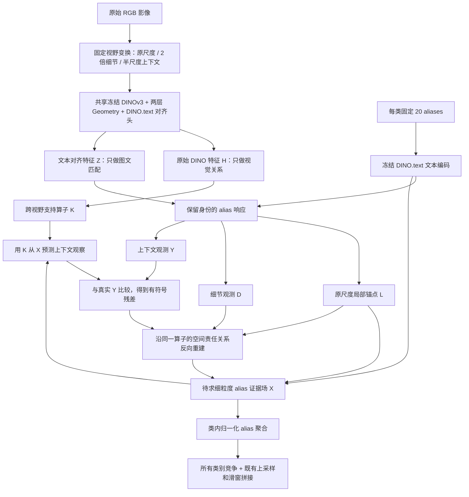

# GEAR-OV：面向八个遥感数据集的冻结证据归属与重建

日期：2026-09-29。

状态：完整候选架构设计，尚未实现或验证。本文区分现有实验事实、拟采用的工程配置和待验证机制；不宣称八个数据集已经提升，也不宣称已经确认首创。本次不启动 GPU 实验，不修改数据协议。

工作名：**Geometry-guided Evidence Attribution and Reconstruction for Open-Vocabulary Segmentation（GEAR-OV）**。名字仅用于集中讨论，不是已核验无重名的正式论文名称。

## 1. 最终研究目标与核心主张

目标是用同一组冻结权重、同一推理规则，在多种遥感分辨率、视角和类别体系下提升像素级 OVSS。

核心问题：**语义证据的识别范围，与标签应该落到的空间范围不同。**

大视野可能帮助识别停车场中的车辆、农田中的植被、屋顶周围的建筑结构，但不能因此把上下文内的每个位置都赋成同一类别。细节分支保留定位，广域分支提供语义观察；模型重建一张能够解释这两种观察的细粒度证据场。

候选创新是：把跨视野融合改写为具有视觉支持范围、保留 alias 身份的观测反演。模型先询问“当前细粒度证据能否解释上下文观察”，再将有正有负的解释残差沿对应的空间责任关系写回。

这是一项方法假设。上下文的 DINO.text 响应不必严格等于局部响应的某种池化；本文的观测算子是可证伪的近似模型，不是物理守恒定律。

## 2. 为什么选择这个问题：现有证据

### 2.1 扩词明显有效，但不是每个类别都受益

| 完整验证集 | canonical + dense Geometry | 20 aliases + dense Geometry | 20 aliases + sparse Geometry |
|---|---:|---:|---:|
| VDD，80 张 | 31.3999 | 38.8511 | 38.6295 |
| Potsdam，504 tiles / 14 原始影像 | 21.2713 | 40.6892 | 40.9438 |

这些对照使用同一两层 Geometry、prefix preserve、512 tile、128 overlap、bilinear 与 Hann probability blending。稀疏化收益很小且跨域变号。

VDD vehicle IoU 却从 canonical 的 36.78 降到 20 aliases 的 9.48。因此不能推出“扩词都可信”，也不能把 canonical-only 当普适修复。

### 2.2 小目标的主要问题之一是误激活扩张

| A_dense 完整结果 | 真实面积比例 | 预测面积比例 | Precision | Recall |
|---|---:|---:|---:|---:|
| VDD vehicle | 0.52% | 5.03% | 9.56% | 92.41% |
| Potsdam car | 1.965% | 17.89% | 10.90% | 99.25% |

Potsdam 的真实 impervious surface 有约 27.37% 被预测成 car，low vegetation 约 14.29%，tree 约 21.90%。不能把这解释成“车太小所以模型看不见”；细节观测的目标之一应是提供 road/tree 等类别的正证据，纠正错误 car。

这里的面积比例只用于事后诊断，不能变成推理时的类别面积先验。

### 2.3 上下文有价值，但收益不能跨域照搬

| 两层 Geometry / preserve | Geometry | BoundedUnion |
|---|---:|---:|
| VDD 完整 80 张 | 38.8511 | 44.0036 |
| Potsdam 完整 504 tiles | 40.6892 | 40.0045 |

历史单层配置中，StructuredAliasUnion 在 LoveDA 上由 P/D 63.9087/43.4661 提升到 67.1703/45.5323；但 UDD5 从 47.1491 降到 46.5608，OEM 从 41.8823 降到 41.3608。不同 head 配置的数字不能混成一个 matched comparison。

这支持继续利用上下文，同时要求修改其写回方式。

### 2.4 不能夸大四路错误交集的结论

VDD / Potsdam 的四路共同错误占全部有效像素 30.43% / 28.35%，约为最佳一路错误的 79.4% / 80.3%。

它限制的是“在这四个 argmax 标签之间选择”的纠错空间，不证明原有特征完全缺乏正确信息。正确类别可能原本排第二，新的分数重建仍可能修复。GT oracle pixel accuracy 也不是 mIoU 上界。

因此本设计同时允许：新增细节/上下文观察，以及对已有分数作有符号重建；不把二者任何一个说成已经证明必要。

## 3. 完整架构：两个模块，一个共享像素状态

模块一：**保留来源的 Geometry 观测编码器**。输出观察范围、空间坐标、原始视觉特征、文本对齐特征和独立 alias 响应。

模块二：**证据归属与重建求解器**。使用模块一的空间算子、alias 字典和真实观测，求解共享的细粒度语义状态。

尺度变换、alias 相关性度量、鲁棒损失和最终聚合是这两个模块的内部步骤，不各自命名成独立创新模块。主版本不额外加入 GAR gate、UOT、SAM、第三个分类头或末端图扩散。

## 4. 模块一：保留来源的 Geometry 观测编码

### 4.1 冻结并复用的部分

- 固定 DINOv3、DINO.text 文本编码器及其文本对齐视觉头。
- 沿用 raw DINO feature cosine + 空间位置项的 Geometry 关系。
- 候选统一采用两层 Geometry、prefix preserve；不依据每个目标集 GT 切换 preserve/block。
- 不把 raw DINO H 与文本 T 直接内积。图文匹配只使用通过原有对齐头输出的 Z。
- Native 不再作为必须参与融合的主分支；既有诊断不支持给它强制等权。

Geometry 的结构项仍为：

\[
A^G_{ij}=\operatorname{softmax}_j\left(
\frac{\langle\hat H_i,\hat H_j\rangle}{\tau_g}
-\frac{\|p_i-p_j\|^2}{2\sigma_g^2}\right).
\]

它用于组织冻结 Value 的读取；完整保留原头的 projection、residual、MLP、normalization 与对齐 projection，不把一次邻接矩阵乘法冒充完整头前向。

### 4.2 三个观察尺度，两种互补任务

| 观察 | 原图等效视野 | 编码输入 | 作用 |
|---|---:|---:|---|
| local anchor | 512 × 512 | 512 × 512 | 保留强 Geometry 基线 |
| detail | 256 × 256 | resize 到 512 × 512 | 看清成员、局部纹理、边缘和反证 |
| context | 1024 × 1024 | resize 到 512 × 512 | 获取地物关系及较大区域语义 |

实现方式是固定 image pyramid {2, 1, 0.5}，在各尺度上使用相同 512/128 滑窗；不是为每个类别生成一个 crop。供求解器使用的特征/alias 观察在同尺度内部按有效坐标与归一化窗口权重合并，重叠不被计作多份独立投票。这种内部观察合并不冒充原 evaluator 的概率拼接；最终输出另行保持原概率拼接路径。

不只对低置信区域做 detail，也不只选择最大的连通域。当前错误包含高置信 car 扩张，仅按不确定性选区域会跳过这些错误。

若 patch size 为 16，细节分支在原图上的采样间隔为 8 像素。这个例子必须从实际 patch_size 推导，不能写死其他 backbone 的数值。低于输入采样极限的细节不会凭空恢复。

context 不等于任意尺寸原图一次压成 512。固定有界视野可以减少不同原图大小引起的观察范围漂移；大型影像仍保留相邻 crop 的坐标关系。

### 4.3 保留完整 alias 维度

有 C 类，每类 20 个固定 aliases，总数 M=20C。遵守当前词表关于 canonical 是否包含在 20 中的定义，不暗中增加第 21 个词。

令冻结文本向量矩阵 T∈R^(M×d)，各行单位化；每个视野输出 H^v 和文本对齐 Z^v。

\[
S^v_{ia}=\langle Z^v_i,t_a\rangle/\tau_a,\qquad \tau_a=0.07.
\]

为避免把对所有类别共同抬升的分量当分类证据，使用固定中心化矩阵 P=I−11ᵀ/M，令 S^v←S^vP。等量 aliases 时相当于类别平衡的共同模式去除，不删除 residual/background 类。

原尺度分数按已知坐标插值到细节网格，得到局部锚点 L；细节实测分数为 D；上下文实测分数为 Y。后两者来自新 RGB 前向，不是对 L 换一个矩阵反复计算。

所有 aliases 先保留。不使用 GT 筛词，也不复活已失败的全图 Top-K GAR。一个词可以在某个位置参与归属，在另一个位置没有影响。

### 4.4 跨视野视觉支持 K

上下文 token j 与细节位置 i 的候选边满足已知坐标映射，并受局部空间范围限制：

\[
K_{ji}\propto\mathbf1[i\in\Omega_j]
\exp\left(\frac{\langle\hat H^C_j,\hat H^D_i\rangle}{\tau_g}
-\frac{\|p_i-p_j\|^2}{2\sigma_j^2}\right),\qquad\sum_iK_{ji}=1.
\]

K 的作用是限定“这条上下文观察允许由哪些细位置解释”，不是 GT mask，不宣称等于 DINO 的真实感受野。

候选实现约定：Ω_j 采用映射到原图的 5×5 个上下文 token 邻域；保留对应中心 token 的全部细粒度子位置，再按 K 的原始分数补足最多 64 个成员。令 τ_g=0.1、σ_j 为原图坐标中两个上下文 token 的间距，全数据集相同。边界处只在有效图像支持上重新归一化。这些是初始固定实现值，不是已验证最优值。

不建全图 N×N 图。稀疏候选是计算约束，不把前面近中性的 sparse Geometry 实验重新包装成主要创新。

跨尺度 raw feature 的可比性与支持范围是否合适均是风险；模型的鲁棒项只能缓解不一致，不能保证修复错误 K。

## 5. 模块二：证据归属与重建

### 5.1 共享未知量是像素证据场

未知状态 X∈R^(N×M) 表示细网格上每个位置对所有 aliases 的证据。每个像素仍可独立分类，不建立“一个 region 只能一个标签”的约束。工程实现按带 halo 的原尺度滑窗工作区求解，工作区内所有观察共享同一个 X；halo 覆盖 K 的空间支持，输出只取中心有效区域。不宣称独立工作区的局部求解等价于一次全图联合最优解。

为使更新保持文本语义关系，而非任意修改 M 个通道，令中心化字典 T̃=PT，取其行空间在 d 维中的正交基 B∈R^(d×r)，E=T̃B∈R^(M×r)。

\[
X(U)=L+UE^\top,\qquad U\in\mathbb R^{N\times r}.
\]

U 是当前图像的待求语义修正，不是跨图像学习的参数。E 完全来自冻结文本字典。相似 aliases 的修改受共同文本方向约束；不存在每个 alias 一个任意学习到的分类头。

修正后的 X 是语义证据，不声称仍是单位特征产生的原始余弦相似度。

### 5.2 从细粒度证据预测上下文

对同一个 alias a 定义近似观测算子：

\[
\mathcal O_K(X)_{ja}=
\tau_o\log\sum_i K_{ji}\exp(X_{ia}/\tau_o).
\]

已将 cosine 除以 τ_a，候选初始 τ_o=1。这里空间池化保留 alias 维度；预测上下文时再用 P 去除所有 alias 的共同模式。

直观上，如果上下文在一个位置观察到 car，模型要求允许范围中的细节证据能够解释该观察，但不强迫每个成员都高响应 car。对于大片均匀地物，多处相近证据可以共同解释观察。

这不是 object/stuff 的精确生成模型：小面积存在证据会受归一化和温度影响，不同尺度响应也可能不满足该函数。需要检查预测上下文与实测上下文的关系，不能因为公式优雅就默认成立。

### 5.3 alias 与 Geometry 真正耦合的位置

观测算子的导数是空间责任分布：

\[
R_{jai}(X)=\frac{K_{ji}\exp(X_{ia}/\tau_o)}
{\sum_{i'}K_{ji'}\exp(X_{i'a}/\tau_o)}.
\]

同一个上下文 token 的 car、road、tree 可以拥有不同 R。K 约束视觉连续性和坐标，X 的 alias 响应决定某个语义证据更应归属于哪些成员。

这与“先平均 20 个词，再对整张类别图传播”有实质差别：alias 的身份直接参与空间写回规则。更换 alias 可以改变哪个位置收到修正，而不只是改变最终一项类别分数。

区别不来自交换两个 log-sum-exp 的先后顺序；在可分离权重下，单纯的类内聚合与尺度聚合可以交换，之前 ClassScaleUnion/AliasScaleUnion 已说明这一点。这里每个 alias 都与其独立实测上下文匹配，进入鲁棒重建损失和空间责任更新，随后才聚合到类别，不能一般地交换成一次普通 class-level union。

同义词不会被要求相互排斥；不相似也不等于反证。真正的竞争证据来自另一个类别在细节/上下文中的实际响应，以及这些响应的共同解释约束。

### 5.4 相关词不等于多份独立证据

固定文本相关矩阵 G=T̃T̃ᵀ；采用正则化度量 W=(G+εI)^(-1/2)，候选 ε=0.1。

W 用于残差度量，减少一组近重复词对目标函数的重复占重；不产生图像级保留/删除词表，也不输出“某词正确概率”。ε 避免接近零的特征值被无界放大。

这是常规相关性校正，不能单独作为新颖性贡献。文本上很相似但视觉含义不同，或文本上不同但都误激活的 aliases，仍可能无法由该度量辨别。

### 5.5 完整推理能量：三项来自同一个问题

令 ρ_δ 为 Huber 损失：小残差为 0.5r²，大残差为 δ(|r|−0.5δ)，初始 δ=1。

对 n 行、M 列的残差，定义：

\[
\Phi(R)=\frac1{nM}\sum_{j,a}\rho_\delta((RW)_{ja}).
\]

求解：

\[
\boxed{
U^*=\arg\min_U
\underbrace{\frac{\lambda_0}{2NM}\|(X(U)-L)W\|_F^2}_{\text{保留局部 Geometry 锚点}}
+\underbrace{\lambda_D\Phi(X(U)-D)}_{\text{解释真实细节观测}}
+\underbrace{\lambda_C\Phi(\mathcal O_K(X(U))P-Y)}_{\text{解释真实上下文观测}}
}
\]

候选起始 λ_0=λ_D=λ_C=1，三项按对应观察数量归一化。这些数值是可实施起点，不是已经测出的优选配置；正式版本必须全数据集共用一套值，不能每集按 GT 选参。

不额外叠加 Laplacian loss。空间耦合已经由 K、重叠观察和共同 X 提供；旧实验没有显示独立末端图项有稳定实质增益。

Huber 可以等价理解为带 L1 代价的异常残差吸收，限制不一致观察的影响；它并不保证自动识别错误上下文，更不是严格全拒绝。不能把鲁棒权重宣称为已校准的正确性概率。

### 5.6 正修正与负修正都有

记上下文创新 r=Y−O_K(X)P。省略中心化、文本度量和语义子空间投影时，一次梯度写回的形式是：

\[
\Delta X_{ia}\propto\sum_jR_{jai}(X)\,\psi(r_{ja}),
\]

其中 ψ 是鲁棒影响函数。正式实现必须包含 P、W 和 E 的完整链式求导，不能直接把上式当全部更新。

- 实测上下文比当前解释更支持某个 alias，可以给对应成员正修正。
- 当前解释过度预测某个 alias，而真实细节或上下文不支持，可产生负修正。
- 只有别的类别的正证据和多观测约束，才有望可靠地压回错误类别；单个低相似度不是“该类别不存在”的证明。

BoundedUnion 的 `τ log((exp(l/τ)+exp(h/τ))/2)` 对负上下文最多把 local 降低 τlog2，而正增强可更大。新求解器不继承这一单侧增强结构，但它是否因此改善真实误扩张仍需验证。

### 5.7 为什么这是闭环，而非换名 attention

循环为：X → 预测上下文 → 对照独立 RGB 实测 Y → 计算残差 → 用同一算子导数归属 → 更新 X。

新的 R 来自当前 X，但 Y、D、K 在本图求解中固定。系统不把自己的最新预测当新监督反复强化。

如果当前 X 已解释实测上下文，该观察不应仅因“分类置信很高”再被重复加入。如果 D=L 且 Y=O_K(L)P，则 U=0 是能量的零修正最优解。

这不消除所有自我强化风险：R 依赖当前 X，高置信错误可能吸走责任。全覆盖 detail、有限次数更新和局部锚点可以限制问题，无法保证解决。

## 6. 推理算法与输出

1. 缓存当前数据集固定词表的 T、B、E、W；仅依赖文本。
2. 并行或批处理三个图像尺度，在各自窗口中运行同一冻结 Geometry 编码器。
3. 记录原图坐标、valid mask、H 和独立 alias 响应；建立细节网格上的 L/D 及上下文 Y。
4. 按坐标和 raw feature 构造稀疏 K，窗口重叠按既有权重归一化。
5. 初始化 U=0。只对 U 求梯度，视觉与文本编码器均 detach。
6. 进行至多 6 次重建更新；每次使用最多 8 次回溯寻找能量下降步长。找不到下降步保留当前状态；相对能量下降小于 1e-3 时提前结束。初始试探步长 1，回溯每次减半。这是起始数值策略，六步不是已证明收敛。
7. 对所有类别作归一化类内聚合：q_ic=log[(1/20)Σ_(a∈A_c)exp(X*_ia)]。
8. 为避免更换网格/插值顺序暗中改变 local baseline，先计算细网格的类分数残差 Δq=q(X*)−q(L)，再在原工作区像素坐标输出 `logits_final = logits_Geometry_existing + τ_a * bilinear(Δq)`。这里 τ_a 把以温度缩放后的 q 转回现有 Geometry cosine-score 单位。若实际 adapter 已使用温度缩放的 class logits，禁止再乘第二次，必须遵守明确的单位契约。令 U=0 必须数值复现既有 baseline。
9. 使用以上所有类别的最终 logits，按既有 evaluator 的概率化、bilinear 和 Hann blending 路径输出。LoveDA P/D 的类别与背景处理保持原定义；不为了新方法重写协议。

最终没有逐类别 decoder、区域级硬标签，也不限制只能在初始 top-2 类之间切换。

输出除最终分割外，保存 Geometry local、普通同预算 multiscale、最终 logits，以及上下文重构误差、正/负修正量、优化能量轨迹、迭代数和计算统计。GT 只进入事后评估与错误归因。

## 7. 几个典型场景如何工作

### 7.1 Potsdam：道路/树木被误判 car

期望链条：高分辨率 detail 出现 road/tree 的正证据 → X 获得纠正 → car 上下文只由真正支持 car 的局部成员解释 → 假 car 不再依靠整片广播维持。

不能把“低 car 分数”简单当反证；也不使用真实约 1.965% 面积限制预测。如果 detail、local、context 一致误判 car，本模型也可能失败。

### 7.2 LoveDA/OEM：农业、草地、林地的外观相似

detail 可能都像绿色纹理。context 的田块/冠层/布局响应可以改变 X，但应落在相容的成员上，并受到道路、水体等局部反证约束。

尺度反演只能利用冻结模型实际编码到的信息；不会自动创造新的土地利用语义。agriculture/rangeland 等概念缺口可能需要更好的词义约束或其他预训练模型，不能保证由当前机制覆盖。

### 7.3 VDD：roof、wall 和视角

墙面与屋顶需要既有官方类别定义、不同细节特征与上下文关系一起区分。若一个 roof alias 被错误标为 wall，模型不能仅凭 `roof≈roof` 自动推断数据集真值的父类；必须先纠正词表语义归属，不能用推理公式替代本体定义。

### 7.4 小目标与薄结构

detail 全覆盖避免小面积对象被“大区域优先”的策略跳过；R 允许一个上下文支持内存在多个类别；最终仍输出独立细网格分数。

这不等于达到像素级真实边界精度。最终性能仍受 patch sampling、DINO 表征和上采样限制。

## 8. 计算预算与 training-free 定义

每单位原图面积的编码工作量，忽略边界时约为 1 + 4 + 1/4 = **5.25 倍单尺度**。真实耗时还取决于滑窗重叠、batch 和重建开销，不能称几乎免费。

若 N 为细节 token 数、J 为 context token 数、每个 context 保留 k≤64 条边、M=20C：

- 稀疏空间观测/责任操作约 O(JkM)，按 alias/边分块。
- 文本子空间投影约 O(NrM)，残差度量朴素实现约 O((N+J)M²)，可缓存字典分解。
- 不存全图 N² attention，也不重复运行每个类别的图像 backbone。
- 既有输入窗口内 Geometry attention 开销保持；文本编码每套词表缓存。
- 八卡按图像/分片并行推理，不是八卡梯度训练。

新增可训练参数为 0。每张图优化 U，结束即丢弃；不更新网络，不保留跨测试图的 prototype、阈值或权重，不使用目标 mask 构造证据。

准确定位为 **weight-frozen, optimization-based training-free inference**。它包含逐图数值优化，不能宣传为无优化、单次前向或零额外计算。

所有原有数据集都经历了多轮结果驱动的设计，必须披露探索性开发。冻结权重不等于从未利用验证结果改模型。

## 9. 与现有路线的关系和新颖性边界

| 路线 | 可借鉴内容 | 本候选需要建立的区别 |
|---|---|---|
| 当前 Geometry / VIP 相关视觉读取 | 冻结 DINO 结构与文本对齐，扩词增加表达覆盖 | 不把 affinity 替换或扩词本身称首创；新问题是跨视野语义证据归属 |
| VIP alias selection | 不应默认每个扩词可靠 | 本设计保留词、按位置和解释残差使用证据；不是复现其跨无标签测试集合筛词 |
| PCA-Seg | 并行信息读取避免被固定串行顺序完全决定 | 分支按真实观察视野区分；不用 FOD 强制正交，不声称无训练等价于学到的 EPL |
| TriSim | 图图、图文、文文关系共同参与判别 | H 构造支持、Z/T 产生观测、T/T 约束修正；不宣称迁移其训练过的检索能力 |
| Jev 讨论 | 根据观测创新决定是否值得修正 | 只是思想关联；没有使用其可学习决策模型，不在贡献中虚称集成 |
| 多尺度测试 / CRF / MIL / 逆问题方法 | 新观测、结构化推断、软空间归属、鲁棒拟合 | 必须对照同预算普通多尺度，证明别名保留的前向观测与反向归属确有作用 |

候选论文可围绕一个主贡献、两个实现环节表述：**将冻结 VLM 的上下文融合改写为保留语义身份和空间来源的证据归属与重建。**

log-sum-exp、鲁棒损失、文本 Gram 矩阵、反向投影和多尺度本身都有先例；组合仍可能与现有方法重叠，不能仅凭新名称认定 CVPR 级创新。

本次尝试新的文献检索时遇到认证/网络失败。上述具体 VIP/PCA/TriSim 判断沿用已有原文核查笔记，不代表完成了当前全领域查新。提交论文前必须补查 training-free dense prediction、multi-view semantic reconstruction、MIL attribution 和 language-guided super-resolution 的近邻工作。

## 10. 八个数据集：固定方法，不追八套专用配置

建议实验集合如下；后两项是规划，不是已具备完整可评测数据。

| 数据集 | 核心压力测试 | 当前边界 |
|---|---|---|
| LoveDA | 城乡差异，land cover / land use，背景竞争 | P/D 是同一数据集的两个协议，不算两个数据集 |
| UDD5 | UAV 视角、车辆误激活 | 当前可用验证 40 张 |
| OEM | 区域迁移、8 类地表混淆 | 当前 500-entry split 仅有 384 张；正式表必须标明，补齐后另报 |
| VDD | 视角、wall/roof、稀有 vehicle | 当前验证 80 张，官方类别语义已纠正 |
| Potsdam | 高分辨率 car 与地表混淆 | 504 tiles 来自 14 原始影像，不算 504 独立场景 |
| Vaihingen | 与 Potsdam 相近类别下的传感器/GSD 转移 | 此前暂缓；不宣称新方法已评测 |
| iSAID | 密集小型目标与尺度 | 先确保有带语义标签的合法验证集；无标签 test 不可报 mIoU |
| FLAIR-1（建议第八项） | 更细地表语义、地域转移 | RGB/标注可用性、地理独立性、既有使用历史待审计 |

不按数据集切换 head depth、prefix policy、词表生成策略、λ 或迭代预算。不从 GT 推估车面积、类别频率、置信阈值或最佳 crop 尺寸。

类别定义、标签映射和已锁定 evaluator 必须尊重各自协议；“同一推理规则”不等于擅自合并不同数据集的类别本体。

统计以原始影像/地域为单位，尤其 Potsdam 不把相关 tiles 当独立 bootstrap 样本。报告每数据集 mIoU/逐类 IoU，以及八集等权均值作为辅助汇总，不让大数据集像素数淹没其他集合。

## 11. 接下来按什么顺序落实

### 第一步：冻结设计接口

新增候选文件可为：

- `dinotool/gear_observations.py`：三视野 RGB 编码、坐标、H/Z、独立 aliases。
- `dinotool/gear_reconstruction.py`：稀疏 K、观测算子及导数、文本子空间、推理能量和求解。
- `dinotool/gear_ov.py`：完整端到端编排；输出三组 observation 与 final。
- `scripts/eval_gear_ov.py`：复用现有 dataset adapter、label mapping、metrics。

当前 `tcpr.py` 的 frozen encoder 路径可复用；`contextual_phrase_readout.py` 提供坐标采样参考。不能直接把旧 crop pooling/broadcast 模块换名：它丢失成员分布、漏覆盖小区域，且曾有 CLS/patch 文本空间匹配风险。

### 第二步：先过观测模型关口

无需先证明每个部件都独立加分，但核心观测关系必须检查：

1. 在同视野/已知映射条件下，K、中心化、边界和前后向数值正确。
2. 真实上下文 Y 与 O_K(X) 的差异是否与类别/尺度系统性偏移有关；拟合更好不自动等于分割更好。
3. 反向写回是否只在部分细位置起作用，是否存在错误种子吸走全部责任。

不能在这个假设明显失败时继续增加 gate 把公式“补”成无法解释的系统。

### 第三步：仅三个主系统决定继续价值

同权重、同词表、同 evaluator：

1. 两层 Geometry-20 单尺度。
2. Geometry-20 普通多尺度，使用完全相同 {2,1,0.5} 观察和上采样；固定一种聚合，不按数据集择优。
3. 完整 GEAR-OV。

这样先回答总性能改善、增加计算的收益、归属重建本身的收益。普通多尺度已经很好时，也不能把其收益全归给新求解器。

主系统稳定后才做诊断性拆解：class-first vs alias-preserving、无空间归属的均匀写回、去掉解释残差而直接加 context、仅细节观测、词表扰动。它们用于支撑核心主张，不在当前设计阶段堆成几十个 arm。

### 第四步：跨域与论文关口

- 当前已看过的集合用于开发分析；真正独立的地域/数据在冻结规则后测试。
- 重点检查 vehicle/car 的 precision 与 recall，road/tree 及 residual 类有没有被压制。
- 检查四路旧共同错误中是否有新增修复，不把其像素准确率误写成 mIoU 上界突破。
- 若多集提升且在同预算多尺度之上仍有稳定收益，才支持新机制贡献。
- 若只胜单尺度，未胜同预算多尺度：可以报告模型工程有效，但核心贡献应收缩，不能声称已证明归属反演必要。
- 若弱类提升靠广泛牺牲 other/background 或强类，不能宣称泛化问题已经解决。

## 12. 推荐论文叙事

研究问题：冻结视觉语言模型扩大语义观察范围后，如何保留像素级类别归属？

方法回答：几何信息约束可解释的成员集合，细节与上下文分别产生独立观察；完整 alias 字典参与共同语义状态的重建。通过解释上下文与定位解释残差，避免把区域语义一律广播给像素。

可检验的三项主张：

1. 上下文增强的识别证据与其空间归属存在失配，这种失配在多个遥感域表现为扩张和误修正。
2. 保留 alias 身份的前向观测/反向归属，在相同观察预算下优于普通跨尺度聚合。
3. 一个固定的无标注推理目标，可以兼顾细节辨别与广域语义，并在跨域评价中减少误修正而不只扩大高置信区域。

这三点当前均不能写成已经成立的最终结论。已有实验为第一点提供动机，但没有完成机制归因；第二、三点需要候选模型结果。

## 13. 最主要失败风险

1. 真实上下文不是局部证据的池化，观测模型错配可能伤害土地利用类别。
2. 所有尺度共同犯错，缺乏新反证，闭环仍会稳定在错误解。
3. 高置信错误吸走 R，导致更新自我强化。
4. text covariance 度量不等于视觉可辨性，相关性校正可能削弱有用词组。
5. small-object 与大区域需要不同统计，统一 τ_o 可能折中不佳。
6. 5.25 倍视觉预算可能贡献大部分收益，必须报告同预算 baseline。
7. 低观测能量不保证高 mIoU；必须独立评估分割与类面积/precision/recall。

这些风险限定方法能声称什么，不要求现在再设计更多模块。失败时首先检查观测假设和有效新信息，而不是追加模块名称。

## 14. 证据来源

- `research/LOCAL_READOUT_2X2_DIAGNOSIS_20260929.md`
- `research/local_readout_2x2_full_vdd_20260929_results.json`
- `research/local_readout_2x2_full_potsdam_20260929_results.json`
- `research/VDD_POTSDAM_TWO_DEPTH_EXPERIMENT_20260929.md`
- `research/CONTRASTIVE_CONTEXT_A800_SCREEN_20260929.md`
- `research/TCPR_VIP_TRISIM_DESIGN_20260924.md`
- `research/PCA_FOD_EPL_AND_PARALLEL_FUSION_OPTIONS_20260923.md`
- `research/CONNECTED_CONTEXT_OV_FINAL_MODEL_20260924.md`
